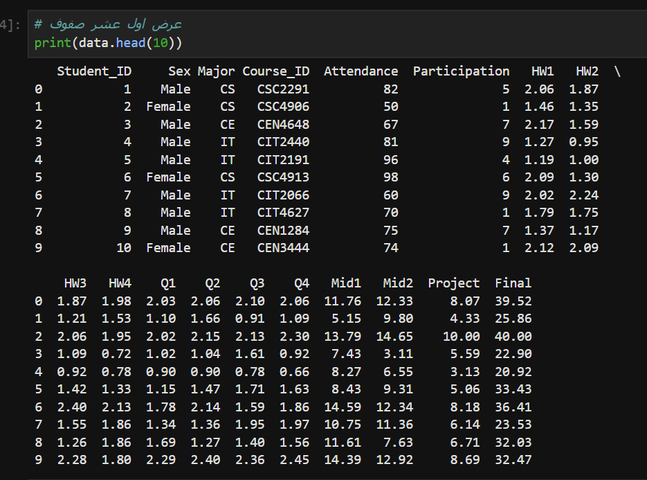
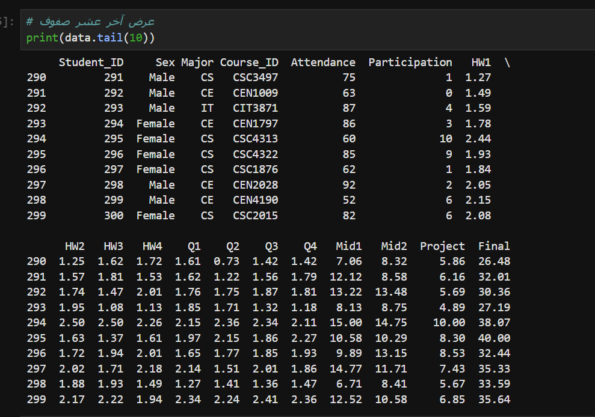
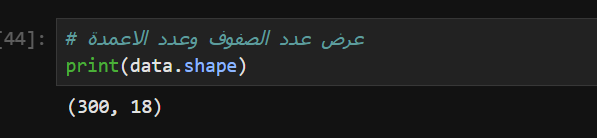
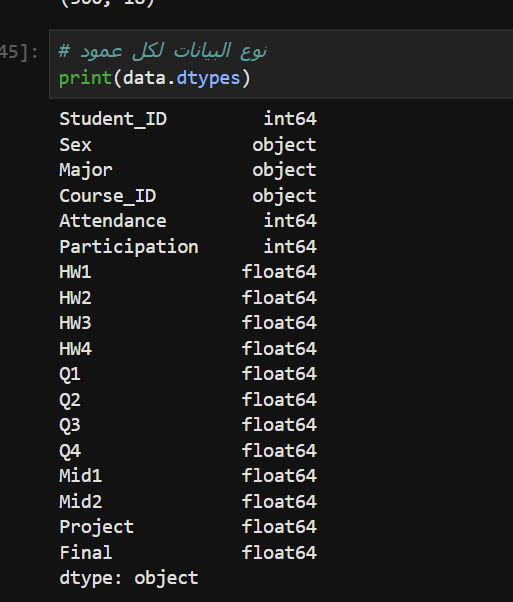
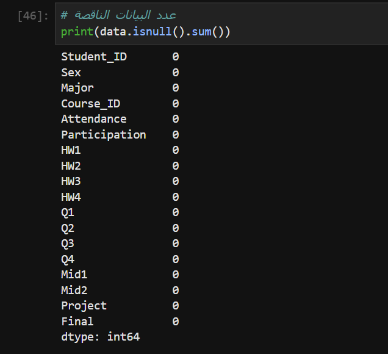
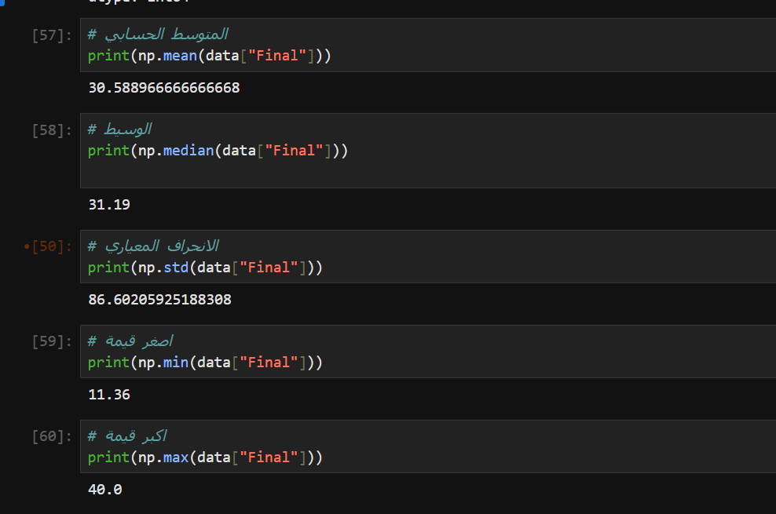
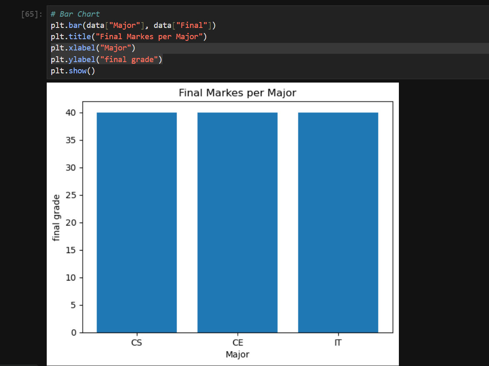
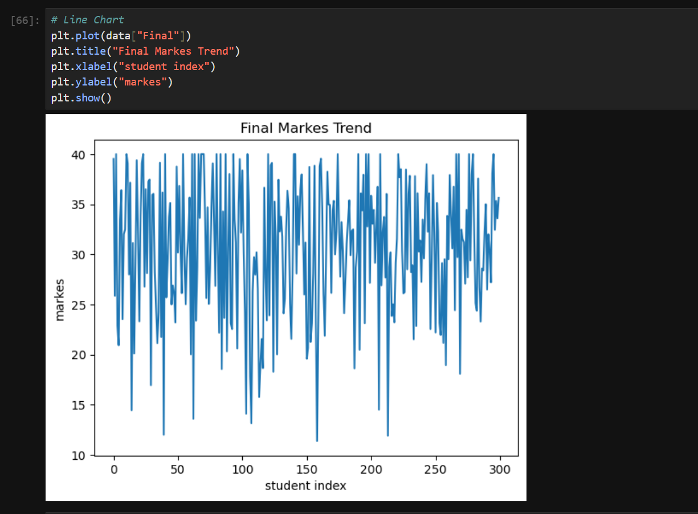
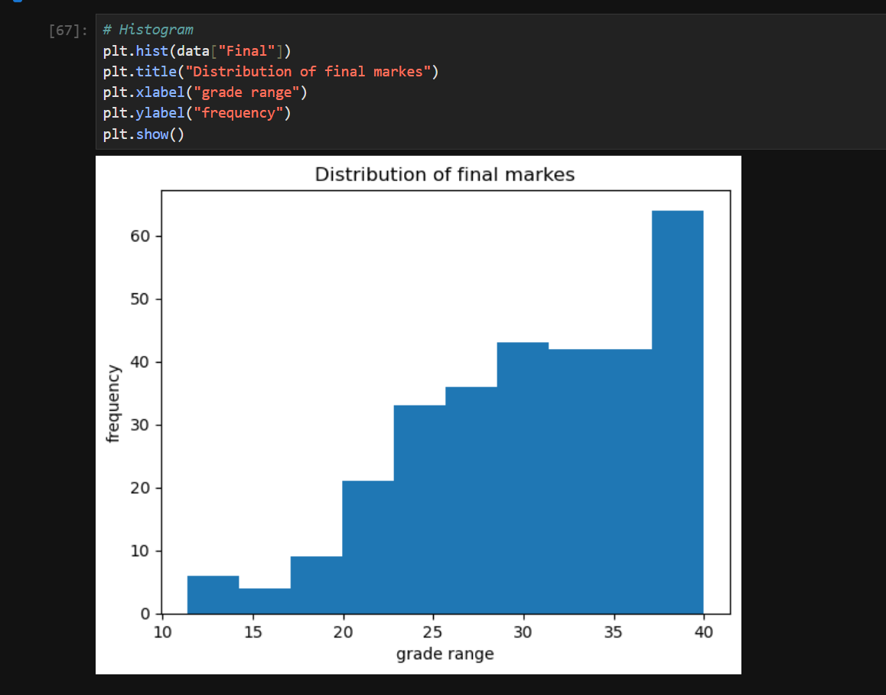

# 📊 Student Performance Analysis Project

## 💡 Project Overview
This project analyzes student performance data to identify the key factors that influence students’ final grades.  
Using Python libraries for data analysis and visualization, the project explores relationships between:

- Attendance
- Participation
- Homework
- Quizzes
- Midterms
- Projects
- Final Grades

The analysis compares student performance across different majors:
- Computer Science (CS)
- Information Technology (IT)
- Computer Engineering (CE)

The main goal is to discover patterns and insights that may help improve teaching strategies and academic performance.

---

# 🛠 Technologies Used

- Python
- Pandas
- NumPy
- Matplotlib

---

# 📂 Dataset Information

- Total Rows: 300
- Total Columns: 18
- Dataset Type: Cleaned Student Performance Dataset
- Missing Values: None ✅

---

# 🔍 Project Steps

## 1️⃣ Importing Libraries
```
import pandas as pd
import numpy as np
import matplotlib.pyplot as plt
```
### Explanation
- pandas → Used for reading and organizing data.
- numpy → Used for statistical calculations.
- matplotlib → Used for data visualization.

---

## 2️⃣ Reading the Dataset
```
data = pd.read_csv(r"C:\Users\Administrator\Desktop\student_dataset_clean.csv")
```
### Explanation
Loads the dataset into a DataFrame for analysis.

---

## 3️⃣ Exploring the Data
```
print(data.head(10))
print(data.tail(10))
print(data.shape)
print(data.dtypes)
print(data.isnull().sum())
```
### Explanation
- head() → Displays the first 10 rows.
- tail() → Displays the last 10 rows.
- shape → Shows the dataset dimensions.
- dtypes → Displays data types of each column.
- isnull().sum() → Checks for missing values.

---

## 4️⃣ Statistical Analysis of Final Grades
```
print(np.mean(data["Final"]))
print(np.median(data["Final"]))
print(np.std(data["Final"]))
print(np.min(data["Final"]))
print(np.max(data["Final"]))
```
### Explanation
This section calculates:
- Mean
- Median
- Standard Deviation
- Minimum Grade
- Maximum Grade

These statistics provide an overview of student performance.

---

# 📈 Data Visualizations

## 📊 Bar Chart — Final Marks per Major
```
plt.bar(data["Major"], data["Final"])
```
### Description
Compares final grades across different majors.

---

## 📉 Line Chart — Final Marks Trend
```
plt.plot(data["Final"])
```
### Description
Shows how final grades vary across students.

---

## 📌 Histogram — Distribution of Final Marks
```
plt.hist(data["Final"])
```
### Description
Displays the distribution of students’ final grades.

Most students scored within the high-performance range (80–90).

---

# 📷 Output Screenshots

## Dataset Preview

### First 10 Rows


### Last 10 Rows


---

## Dataset Information

### Dataset Shape


### Data Types


### Missing Values Check


---

## Statistical Analysis

### Mean, Median, Standard Deviation, Min, and Max


---

# 📈 Visualizations

## 📊 Bar Chart — Final Marks per Major


---

## 📉 Line Chart — Final Marks Trend


---

## 📌 Histogram — Distribution of Final Marks

---
# 🧹 Data Cleaning

The dataset was checked for missing values using:
```
print(data.isnull().sum())
```
The results showed that there were no missing values in the dataset, so no additional cleaning was required.

---

# 📌 Insights and Conclusions

- The dataset contains no missing values.
- Most students achieved high final grades.
- Statistical analysis shows relatively consistent academic performance.
- Visualizations indicate strong performance across all majors.
- Data analysis can help educators understand student performance trends.

---

# 👩‍🎓 Team Members

- Maryam Waheed
- Sadeem Al-Enezi
- Afrah Al-Enezi
- Aseel Al-Enezi
- Juful Al-Enezi
- Haya Al-Enezi
